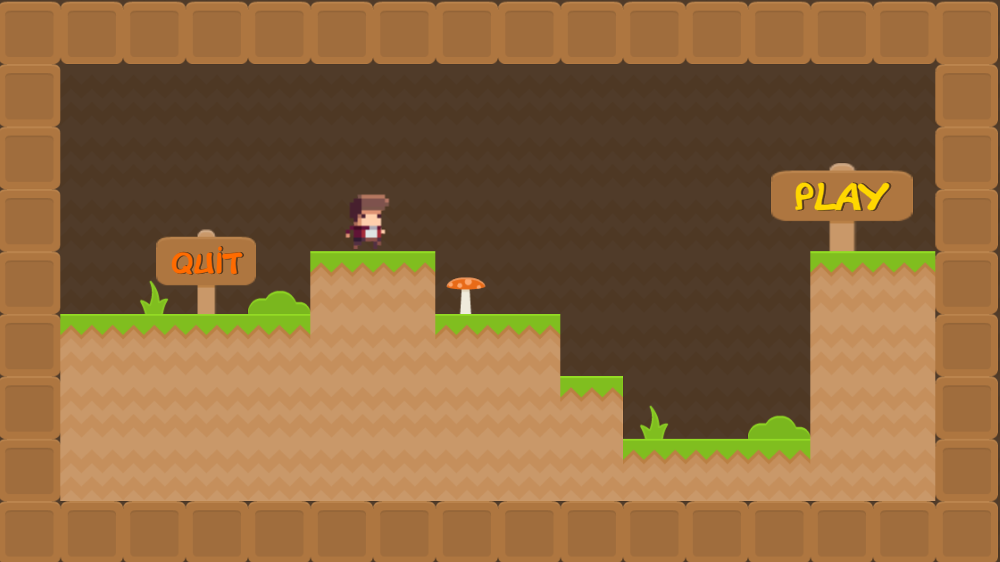
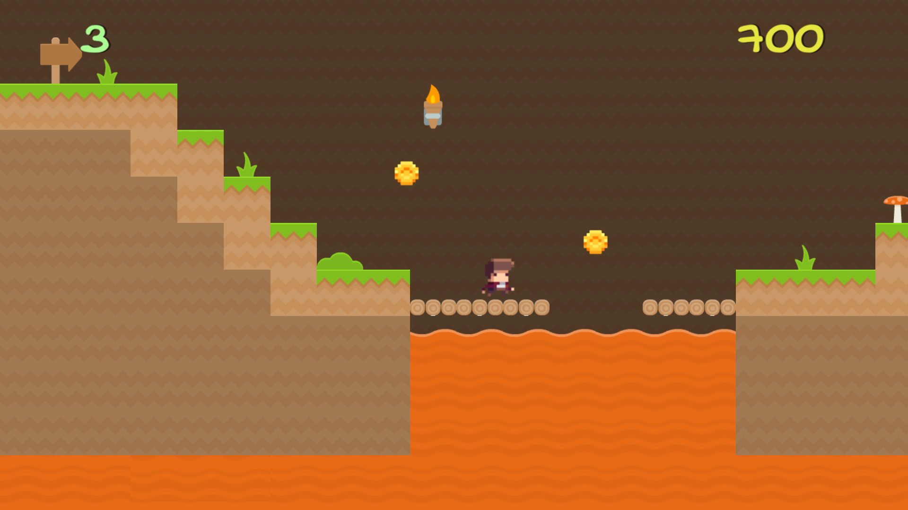

# 2D-Platformer Game
This is a small project created on Unity for advancing skills in Tile Map creation and working with Palette feature. The game contains 4 short Levels with gradually increasing difficulty.
## Screenshots

## Tools used while developing this project
- Unity.
- Visual Studio Code. Coding in C# Programming Language.
- GitBash.
- Inno Setup Compiler (For creating installer files)
## How to Install?
### For Windows User
- Open Folder Named "Game" in 2D-Platformer-Game repository.
- Proceed to Windows Folder.
- Click on 2DPlatformerSetup.exe and download.
- Most probably you will face a warning message. Just Right click on warning and click "Save".
- Now you have an installer file! Open it.
- Windows Defender will prevent running it. Click "More Info" and Click "Run Anyway".
- Proceed with installing and enjoy the game!
### For Mac User
- Open Folder Named "Game" 
- Proceed to Mac and download zip file
- Right click on downloaded file and Open.
- Enjoy the game!
## Contacts 
- E-mail address orkhan.elchuev@gmail.com
- https://github.com/OrkhanElchuev/Gardener-Game
## Acknowledgements
- [dafont](https://www.dafont.com/de/)
- [Freesound](https://freesound.org/)
- [KenneyAssets](https://www.kenney.nl/assets?s=Platformer)
